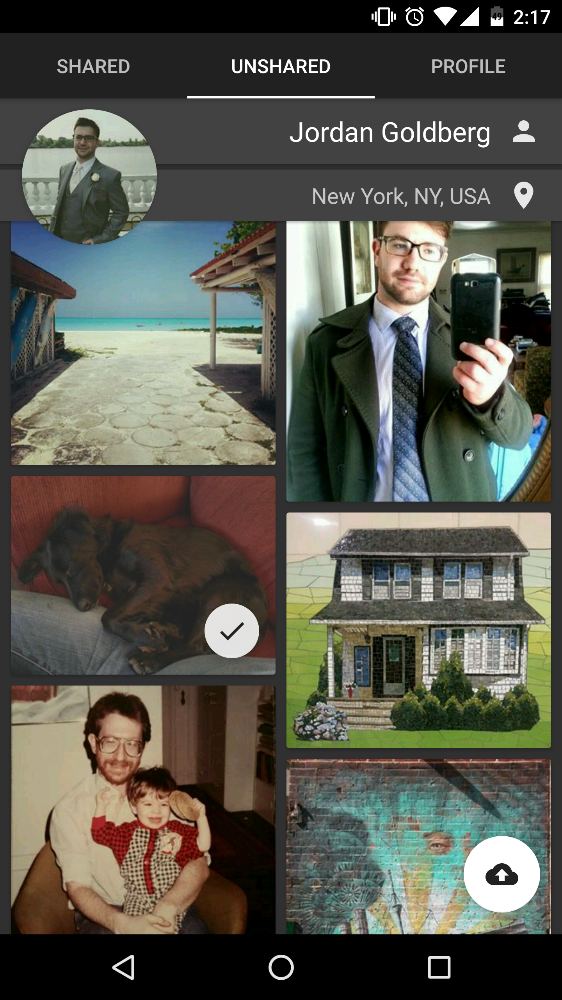
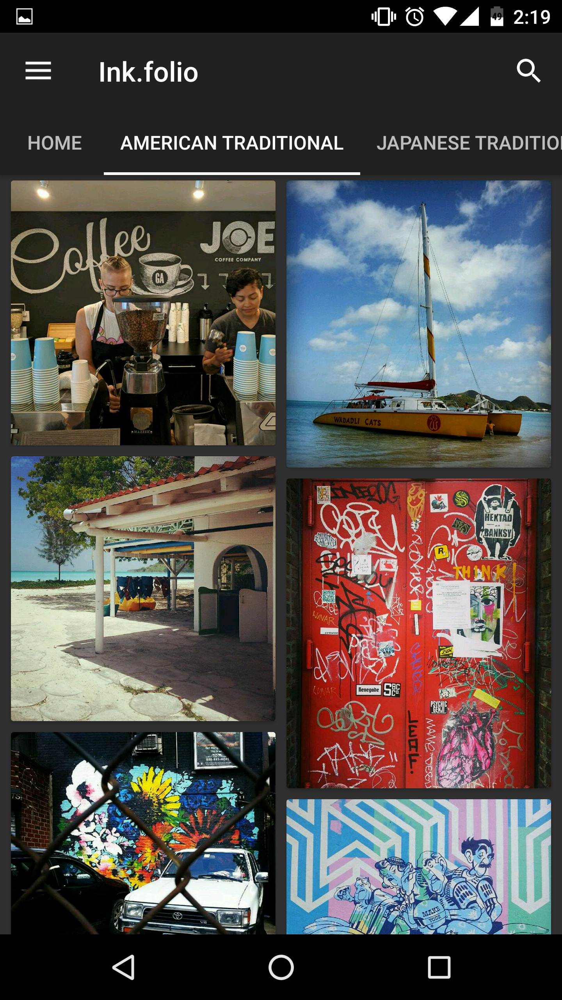

# Ink.folio

  
  

Ink.folio is a portfolio app for **tattoo** artists and recipients alike. It allows users to import their photos from Instagram, tag them with a location, and share them with the larger tattoo enthusiast community. Using a realtime database, the images become searchable by tag. In future implementations, the images will be searchable by location. It's my hope that this app will help people who are looking to get a tattoo connect with an artisit nearby whose body of work they have already seen.

---

### Technical Details

Ink.folio uses Retrofit to create POJOs from the data returned by Instagram API calls. Important fields are then parsed and assigned to custom POJOs which are then stored in a Firebase real-time database. 

The database access is only granted after signing in and authorization with a Google account using Firebase UI. The database indexes values correspodning to time of creation, latitude, and longitude associated with each datum. This allows Firebase RecyclerAdapters to display images efficiently according to query parameters. 

The latitude and longitude information is gotten during Ink.folio account creation using a Google Places autocomplete widget which returns city-level information. This information is attached to each photo imported from Instagram.

This all happens in a beautiful UI designed to highlight the tattoos, and which follows Material Design guidelines.

#### Technologies Used

* **Retrofit**
* **Instagram API calls**
* **Firebase**
* **Google Places**

---

### General Approach

My general approach was lacking in the recommended user research and user stories. Instead, I believed that an initial application should have a design foundation based on a novel creative impetus. Following from this, I designed the application following what I believed to be essential. At every day's end I would take note of unfinished features I was working on and every morning I would lay out a plan for the feature I'd be working on that day.

My plan for the future, once the alpha is at a reasonable place, is to distribute the app to real tattoo artists and at that point conduct user research and craft user storeis based on real people and feedback

---

### Unsolved Problems / Future Plans

#### **No known bugs**

Some essential functionality is still missing which will be implemented in the near future:

* Logging into and out of Instagram
* Ablity to change set user location
* Searching tattoos by location
* Editing image tags
